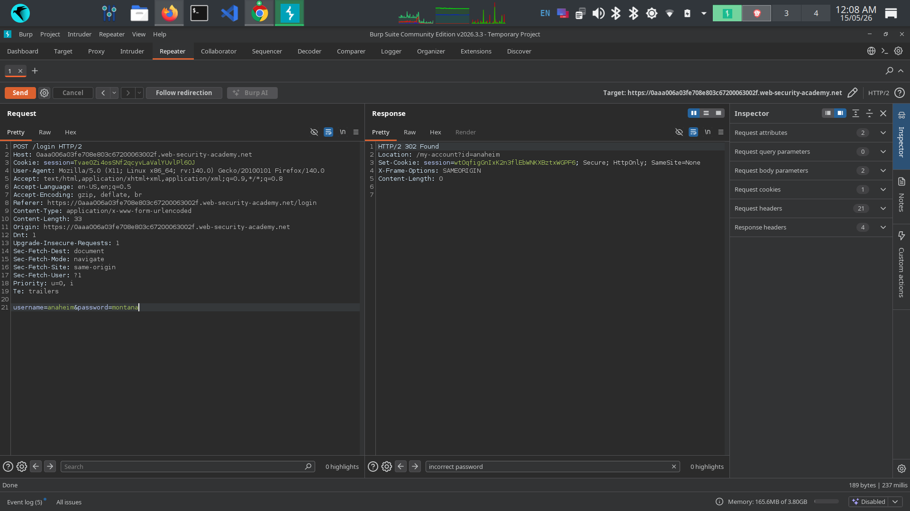
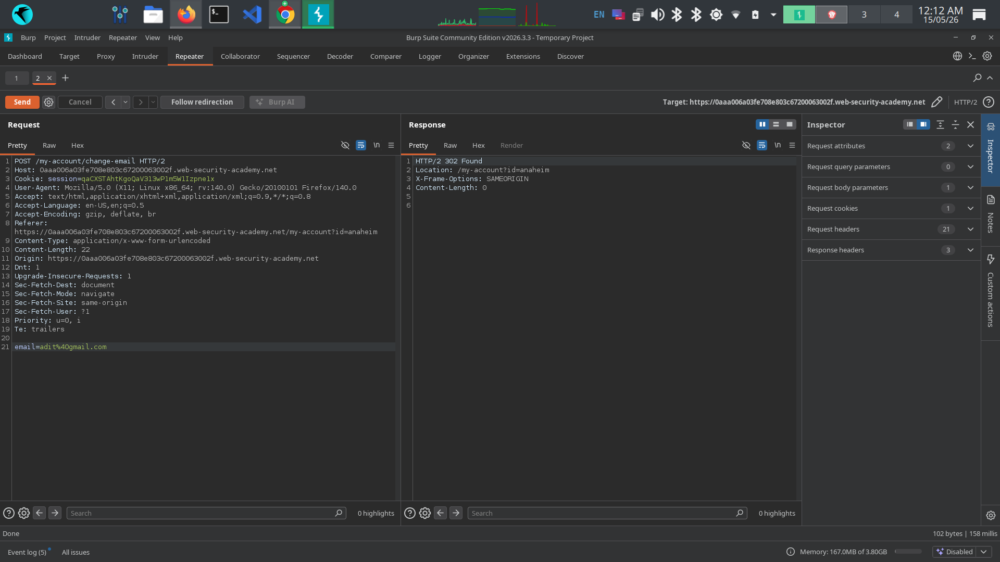

Title: Username Enumeration via Different Error Messages

Severity: Medium
Justification: 
Username existence confirmed via response discrepancy, Full brute force attack chain was not demonstrated during testing.

Endpoint: POST /login

Description:
The login form returns different error messages depending on whether a username exists or not.This discrepancy allows attackers to determine whether specific usernames exist within the application.
Authentication mechanisms should avoid exposing account existence information through distinguishable responses.

False Positive Consideration :
The issue does not directly result in authentication bypass or account compromise.
additional attack vectors such as password spraying, credential stuffing, or brute force attacks would be required for further exploitation.

Observed Behavior: 
Requests submitted with nonexistent usernames returned "Invalid username" while requests using valid username with incorrect passwords returned "Incorrect password".
 
Steps to Reproduce:
1. Navigate to /login
2. Enter an invalid username and any password
3. Intercept POST /login in Burp Suite Repeater
4. Observe response: "Invalid username"
5. Change username to a valid one and resend
6. Observe response changes to: "Incorrect password"
7. Valid username is now confirmed

Evidence:

Security Impact:
Confirmed username existence allows attackers to conduct targeted brute force, credential stuffing, or phishing attacks against valid accounts, increasing the likelihood of successful account compromise. 

Remediation: 
1. Return identical error message for all failed logins
2. Implement rate limiting, progressive delays or additional authentication protections to reduce automated attack attempts. 
3. Implement account lockout after 5 failed attempts

References: 
OWASP OTG-IDENT-004 - Testing for Account Enumeration
https://owasp.org/www-project-web-security-testing-guide/v42/4-Web_Application_Security_Testing/03-Identity_Management_Testing/04-Testing_for_Account_Enumeration_and_Guessable_User_Account
